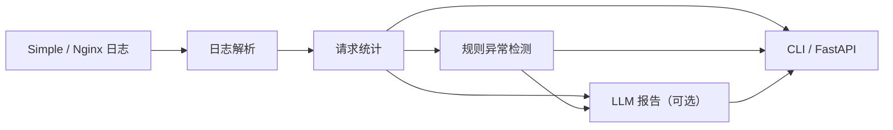

# Log-Sight

[](https://github.com/lajiyige233/logsight/actions/workflows/tests.yml)

[](LICENSE)

一个面向 Web 服务访问日志的 Python 分析工具，支持日志解析、请求统计、规则异常检测，以及可选的 LLM 中文分析报告。

> A Python tool for parsing web access logs, detecting request anomalies, and generating optional LLM-assisted reports.

## 项目简介

Log-Sight 将原始访问日志转换为结构化记录，统计状态码、错误率、热门接口和高频 IP，并通过确定性规则识别异常。检测结果还可以交给兼容 OpenAI Chat Completions 接口的模型，生成便于阅读的中文报告。

异常是否成立由程序规则判断，LLM 只负责解释已有结果和给出排查建议，不参与修改原始统计数据。



## 功能

- 解析项目自定义的 simple 日志格式
- 解析常见的 Nginx combined access log
- 统计有效请求数、状态码分布、4xx/5xx 错误率
- 统计访问量最高的接口与请求次数最多的 IP
- 识别 5xx 错误率过高、慢请求和单个 IP 请求过多
- 通过命令行分析本地日志文件
- 通过 FastAPI 提供 `/health` 和 `/analyze` 接口
- 使用 OpenAI 兼容接口生成可选的中文分析报告
- 使用 Docker 构建和运行服务
- 使用 pytest 与 GitHub Actions 进行自动化测试

## 技术栈

- Python 3.10+
- FastAPI、Pydantic
- OpenAI Python SDK
- pytest
- Docker
- GitHub Actions

## 项目结构

```text
logsight/
├── logsight/
│   ├── analyzer.py       # 请求统计
│   ├── api.py            # FastAPI 接口
│   ├── cli.py            # 命令行入口
│   ├── detector.py       # 规则异常检测
│   ├── llm_config.py     # LLM 环境配置
│   ├── llm_reporter.py   # 提示词与报告生成
│   └── parser.py         # simple 与 Nginx 日志解析
├── sample_data/          # 示例日志
├── tests/                # 自动化测试
├── .github/workflows/    # GitHub Actions 工作流
├── Dockerfile
├── main.py
└── requirements.txt
```

## 快速开始

### 1. 获取代码

```bash
git clone https://github.com/lajiyige233/logsight.git
cd logsight
```

### 2. 创建虚拟环境并安装依赖

Windows PowerShell：

```powershell
python -m venv .venv
.\.venv\Scripts\Activate.ps1
python -m pip install -r requirements-dev.txt
```

Linux / macOS：

```bash
python3 -m venv .venv
source .venv/bin/activate
python -m pip install -r requirements-dev.txt
```

## 日志格式

### Simple

每行包含六个以空格分隔的字段：

```text
timestamp ip method path status response_time
```

示例：

```text
2026-09-08T14:32:15 192.168.1.10 GET /api/users 200 0.065
```

其中 `response_time` 的单位为秒。

### Nginx

支持以下 combined access log 形式：

```text
192.168.1.10 - - [09/Sep/2026:20:15:30 +0800] "GET /api/users HTTP/1.1" 200 512 "https://example.com/" "Mozilla/5.0"
```

## 命令行使用

分析 simple 日志：

```powershell
python main.py sample_data/access.log --format simple
```

分析 Nginx 日志：

```powershell
python main.py sample_data/nginx_access.log --format nginx
```

输出示例：

```text
有效请求总数： 4
状态码分布： {200: 3, 500: 1}
4xx 错误率： 0.00%
5xx 错误率： 25.00%
访问量最高的接口：
  GET /api/users: 2 次
异常检测结果：
  [高] 5xx 错误率过高：25.00%
  [中] 检测到慢请求：1 条
```

## API 使用

启动开发服务器：

```powershell
fastapi dev logsight/api.py
```

启动后可访问：

- Swagger API 文档：<http://127.0.0.1:8000/docs>
- 健康检查：<http://127.0.0.1:8000/health>

向 `POST /analyze` 提交：

```json
{
  "log_format": "simple",
  "include_report": false,
  "lines": [
    "2026-09-10T12:00:00 192.168.1.10 GET /api/users 500 1.2",
    "2026-09-10T12:00:01 192.168.1.11 GET /health 200 0.1"
  ]
}
```

响应中包含解析数量、统计摘要、异常列表，以及可选的 `report`：

```json
{
  "log_format": "simple",
  "valid_lines": 2,
  "invalid_lines": 0,
  "summary": {
    "total_requests": 2,
    "status_counts": {
      "200": 1,
      "500": 1
    },
    "client_error_rate": 0.0,
    "server_error_rate": 0.5,
    "top_endpoints": [
      ["GET /api/users", 1],
      ["GET /health", 1]
    ],
    "top_ips": [
      ["192.168.1.10", 1],
      ["192.168.1.11", 1]
    ]
  },
  "anomalies": [
    {
      "type": "high_server_error_rate",
      "severity": "high",
      "value": 0.5,
      "threshold": 0.1
    },
    {
      "type": "slow_requests",
      "severity": "medium",
      "count": 1,
      "threshold_seconds": 1.0
    }
  ],
  "report": null
}
```

## LLM 报告

LLM 报告默认关闭。复制配置模板：

```powershell
Copy-Item .env.example .env
```

配置项：

| 环境变量 | 用途 |
| --- | --- |
| `LOGSIGHT_LLM_BASE_URL` | OpenAI 兼容接口的基础地址 |
| `LOGSIGHT_LLM_API_KEY` | API 密钥；无鉴权的本地服务可填写占位值 |
| `LOGSIGHT_LLM_MODEL` | 服务提供的模型 ID |
| `LOGSIGHT_LLM_TIMEOUT_SECONDS` | 请求超时时间，默认 60 秒 |

项目已使用本地 llama.cpp + Qwen3 4B 验证。启动一个兼容 `/v1/chat/completions` 的模型服务后，在请求中设置：

```json
{
  "include_report": true
}
```

程序只向模型发送统计摘要和异常列表，不发送完整原始日志。摘要中仍可能包含热门 IP 等信息；接入外部模型服务前，应根据实际数据安全要求进行脱敏。

## Docker

构建镜像：

```powershell
docker build -t logsight:0.1.0 .
```

运行服务：

```powershell
docker run --rm -p 8000:8000 logsight:0.1.0
```

随后访问 <http://127.0.0.1:8000/docs>。如需在容器中生成 LLM 报告，`LOGSIGHT_LLM_BASE_URL` 必须是容器能够访问的地址；容器内的 `127.0.0.1` 指向容器自身。

## 测试与持续集成

运行全部测试：

```powershell
python -m pytest -v
```

推送到 `main` 或创建面向 `main` 的 Pull Request 时，GitHub Actions 会在 Python 3.10 环境中自动安装依赖并运行测试。

## 当前限制

- 异常检测使用固定默认阈值，尚未提供配置文件或 API 参数来动态调整
- 当前 Nginx 日志格式不包含请求耗时，因此慢请求检测仅适用于 simple 格式
- 当前采用一次性批量分析，尚未实现日志持续采集、数据库持久化或可视化面板
- LLM 只解释规则检测结果，不保证建议能够直接定位故障根因

## 后续计划

- 支持自定义异常检测阈值
- 增加时间窗口与请求突增检测
- 增加 IP 脱敏选项
- 部署到云服务器并接入真实 Nginx 日志
- 增加可视化分析页面

## License

本项目采用 [MIT License](LICENSE)。
